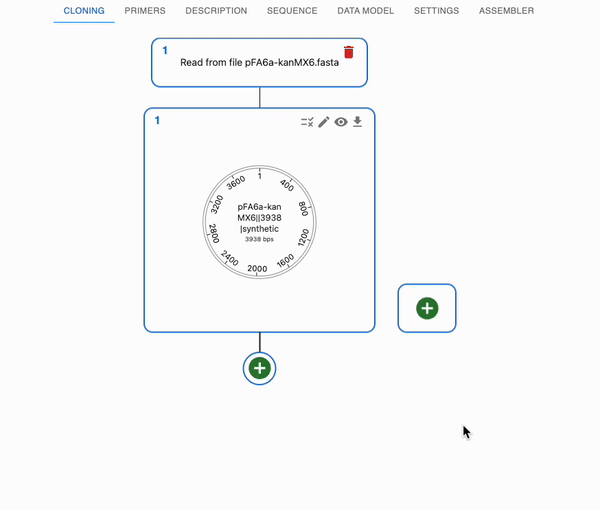

# Annotating sequences

## Manual annotation

You can manually annotate a sequence in the `Sequence` tab.

* Open that sequence in the sequence viewer by clicking on the eye icon on the top right of the sequence in the `Cloning` tab.
* Select a region of the sequence, right-click and select `New Feature`.
* Fill in the form with the feature's name, description, and type.
* Click on `Save`.
* You can cancel the annotation by clicking on the `Cancel` button, or move back and forth between the annotation by clicking o n the `Redo` and `Undo` buttons.
* Once you save it, you cannot go back, but you can continue editing.
* You can also edit or delete existing features by right-clicking on them.
* If you create a primer, it will also be added to the `Primers` tab, and you can use it for cloning.

## Automatic annotation with pLannotate

[pLannotate](https://github.com/mmcguffi/pLannotate) is a tool that can automatically annotate sequences with features. It is integrated into OpenCloning, and you can use it to find features in your sequences.

* Go to the `Cloning` tab and click on the plus icon below a sequence to open the form.
* Select `Annotate features`, then `pLannotate`, then click the `Annotate` button.
* You will get the annotated sequence as a product, and you can see more info about the annotation in the `See Report` button (above the sequence in the `Cloning` tab).

