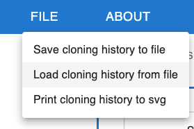

# Exporting sequences and cloning strategies

## Download sequence files (FASTA, GenBank)

You can save a particular sequence as a sequence file (genbank or FASTA), by clicking on the download arrow icon on the top right of that sequence.

## Download cloning history

You can download a `.json` file that contains sequences and their cloning history. You can keep that file or share it with someone else, so they can visualize the same workflow in the browser (see [importing sequences](./importing_sequences.md)). If there is sequencing data associated with the sequences, you can also download the cloning history as a `.zip` file, which contains also the associated sequencing data.

* To save the cloning history of a particular sequence click the download arrow icon on the top right of that sequence and select `.json` or `.zip`.
* To save the history of ALL sequences, click on `File > Save Cloning History to file`.

## Download an image or figure of the cloning strategy

You can download an image of the entire cloning strategy as an `.svg` file. For that, click on `File > Print cloning history to svg`.

