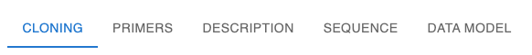
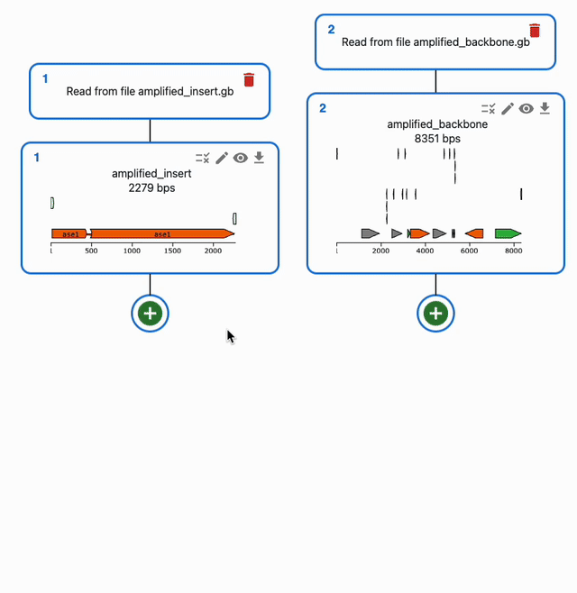
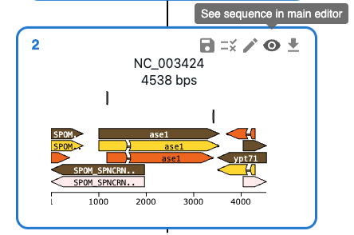
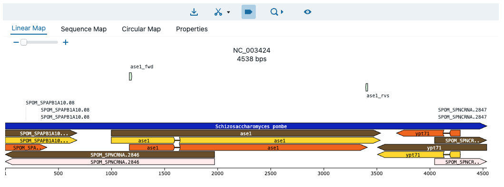
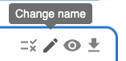
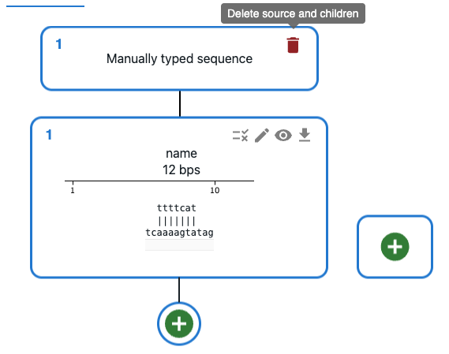
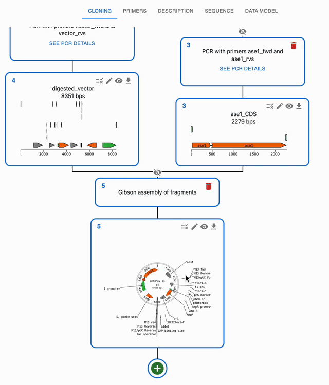

# The OpenCloning interface

At the top of the page, you have four tabs:

* `Cloning`: to load and import sequences, plan assemblies, start primer design, etc.
* `Primers`: to create, import and export primers, and see their properties such as melting temperature, GC content, etc.
* `Description`: to add / see a plain text description for your cloning strategy.
* `Sequence`: A sequence viewer, to see the sequences you have loaded, and their features. When using the [primer designer](./primer_design.md), this tab also allows you to select part of sequences for primer design, such as what regions you want to amplify from a plasmid, or what region you want to replace in the genome (for homologous recombination).
* `Data model`: shows part of the data model that you can download as a `.json` file, in case you are interested on how will that look.

## Use sequences for cloning and genome engineering

In the `Cloning` tab, click on the plus icon below a sequence to open a form where you will be able to select the type of operation you want to perform with it. If a method takes several sequences as input, you will be able to select them from the list of sequences you have loaded in the form.

To understand how to use each of them, see each of the Supported methods on the left sidebar.

## Open a sequence in the sequence viewer

To open a sequence in the sequence viewer, click on the eye icon on the top right of the sequence in the `Cloning` tab. That will bring you to the `Sequence` tab, where that sequence will be displayed in an editor.

The editor has several tabs that offer different views of the sequence, as well as a Properties tab that shows the sequence's properties. That includes a list of cutsites and a list of features, and many other things. For a full list of features, see the documentation of the [OVE sequence editor](https://github.com/TeselaGen/tg-oss/blob/master/packages/ove/README.md).

!!! warning "You cannot edit sequences in the sequence viewer, just view them"

## Rename sequences

By default, when a new sequence is created, it's name is `name`. You can change the name of a sequence by clicking on the pencil icon on the top right of the sequence in the `Cloning` tab.

## Delete sequences

To delete a sequence and its source, click on the trash icon on the top right of the sequence's source. If the sequence is used as an input for something, you will be asked to confirm the deletion.

## Hide ancestors of a sequence

When you are using many sequences, the `Cloning` tab can get crowded. You can hide the ancestors of a sequence by clicking on the crossed eye icon on top of the source of a sequence. To show them again, click on the eye icon.

