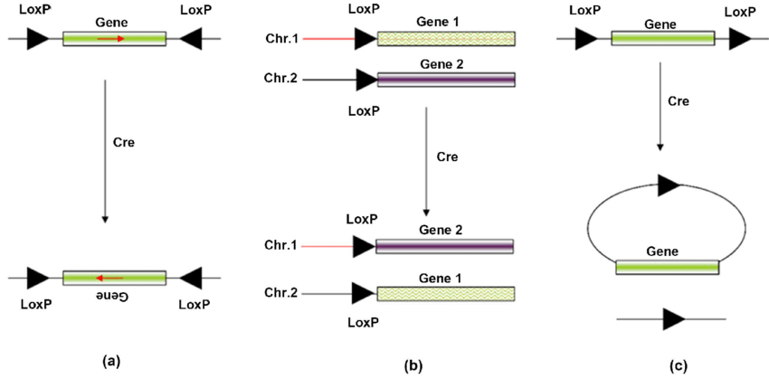
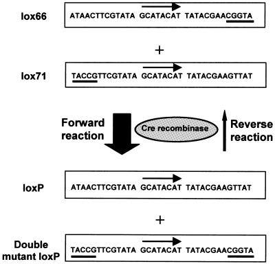
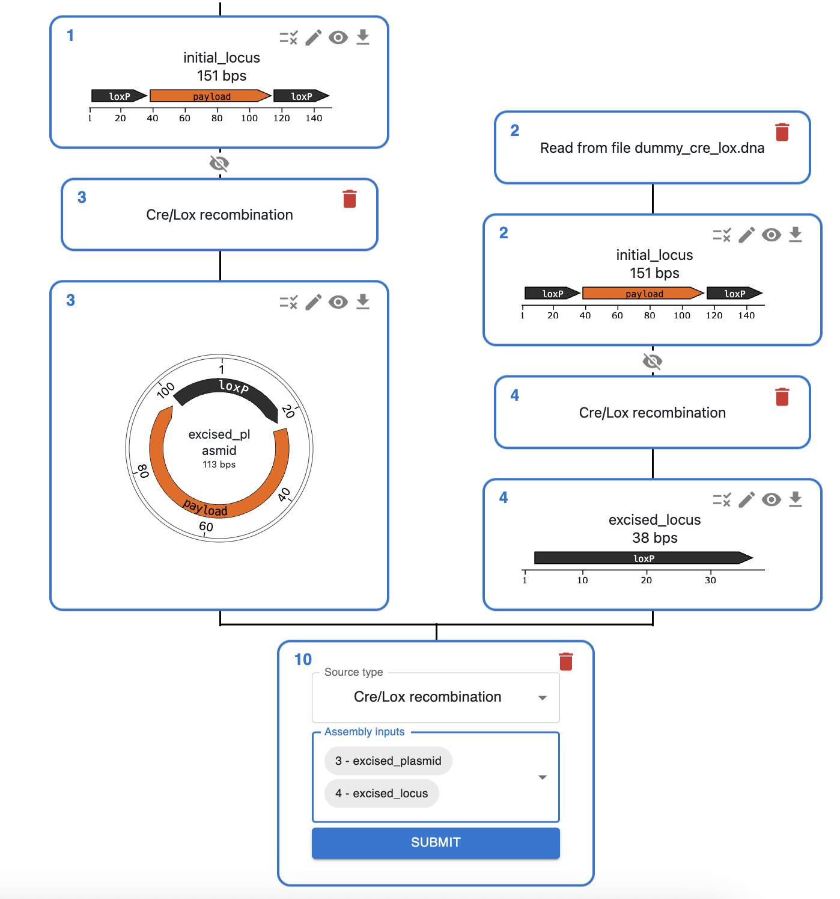

# Cre/LoxP

## What is Cre/LoxP recombination?

Cre/LoxP is a site-specific recombination system derived from bacteriophage P1. It consists of:

* **Cre recombinase**: An enzyme that catalyzes recombination between specific DNA sequences called LoxP sites.
* **LoxP sites**: 34 base pair recognition sequences that serve as the target sites for Cre recombinase. Each LoxP site consists of two 13 bp inverted repeats flanking an 8 bp asymmetric spacer region.

In genetics, induced Cre expression is often used for:

* **DNA inversion** (figure, left): When two LoxP sites are in opposite orientations, Cre recombinase will invert the DNA fragment between them.
* **Chromosomal rearrangement** (figure, center): Placing loxP sites in two chromosomes can produce a chromosomal rearrangement.
* **DNA excision** (figure, right): When two LoxP sites are in the same orientation on a DNA molecule, Cre recombinase will excise the DNA fragment between them, leaving a single LoxP site behind.

However, some systems can use Cre to modify the genome through **DNA integration** (reverse reaction to excision).

### Irreversible Cre integration

Normally, Cre integration/excision is a reversible process. However, some systems use modified LoxP sites that prevent the reverse reaction. An example of this the lox66 and lox71 sites described in [doi:10.1093/nar/gnf089](https://doi.org/10.1093/nar/gnf089).

## How to plan Cre/LoxP recombination using OpenCloning?

* Like any other cloning method, click on the plus icon below a sequence in the `Cloning` tab and select `Cre/LoxP`.
* Then, select the sequences that contain LoxP sites in the `Assembly inputs` field.

!!! info "Sequence topology"

    OpenCloning will treat linear sequences provided as inputs as genomic sequences, so it will only use them as templates
    for integration or excision. For instance, you cannot join multiple linear sequences into a circular plasmid, although
    this would be possible in theory. If you need this functionality, [reach out](https://opencloning.org/contact/).

