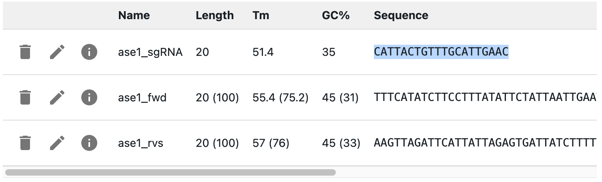

# CRISPR-HDR

## What is CRISPR-HDR?

* CRISPR-HDR (Homology Directed Repair) is a method of genome engineering that uses CRISPR-Cas9 to cut the genome at a specific sequence, and then use homology to repair the cut from a donor sequence that is transformed into the cell.
* The cutting specificity is given by gRNAs, that recognize a specific sequence in the genome through their protospacer, and recruit Cas9 to the site through their protospacer adjacent motif (PAM).
* The Cas9 nuclease then cuts the genome at the protospacer sequence
* The homology arms of the donor sequence are used to repair the cut, which is then integrated into the genome.

## How to plan CRISPR-HDR using OpenCloning

!!! info "gRNA design"
    OpenCloning does not currently have gRNA design functionality, so you will need to use other tools for that.  You can, however, design the primers to add homology arms when amplifying the donor sequence (see below).

Start by designing your gRNAs, and **add their PROTOSPACERS as primers, not the full gRNA sequence** (see [how to add primers](../primers.md#creating-primers)).

Like any other cloning method, click on the plus icon below a sequence in the `Cloning` tab and select `CRISPR`. You will be asked to select the `Template Sequence` (that should be the genome) and the `Insert Sequence` (that should be the donor sequence that you transformed, plasmid or linear DNA). In OpenCloning, CRISPR-HDR works like homologous recombination (see [documentation](homologous_recombination.md) for settings). In addition, the form requires you to select at least a gRNA (you can also select multiple gRNAs).

If you want to design primers to add homology arms when amplifying the donor sequence, see [Primer design](../primer_design.md#primer-design-for-crispr-hdr).

### How are gRNAs used to simulate CRISPR-HDR?

OpenCloning checks that gRNAs cut inside the part of the genome sequence that will be replaced by the donor sequence. If they do not, you will get an error message. It does not check for off-target effects.
