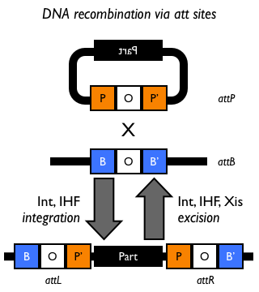
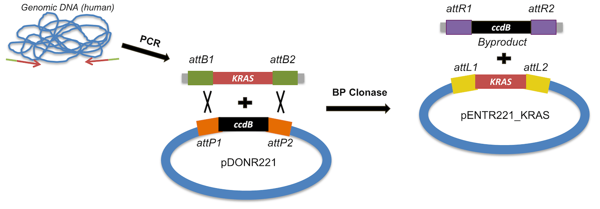
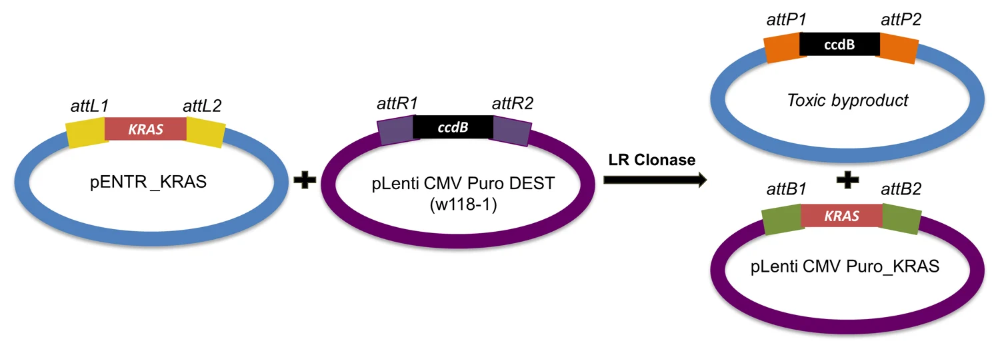
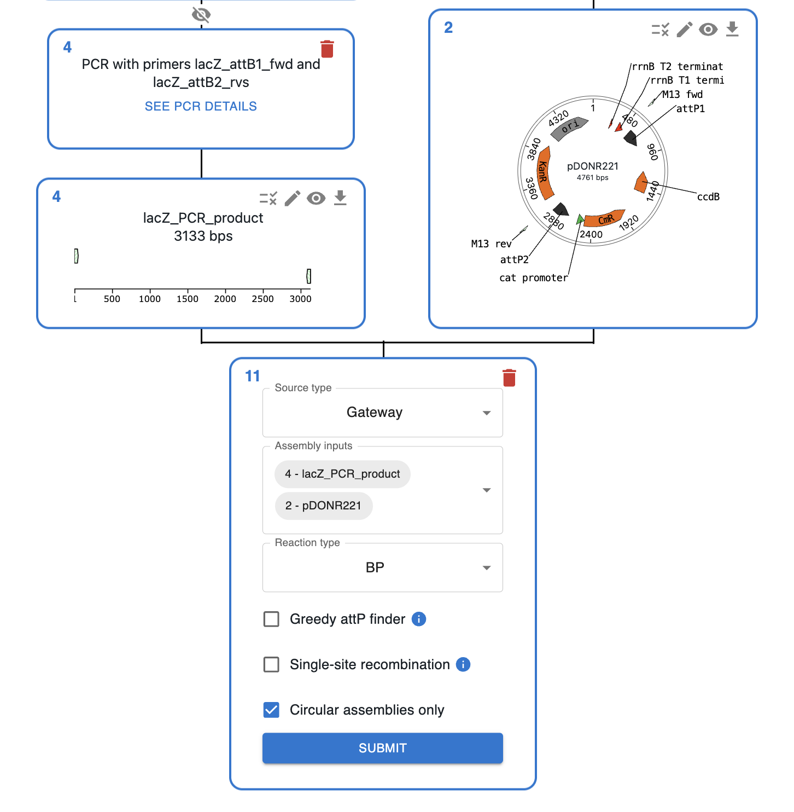

# Gateway Cloning

## What is Gateway Cloning?

### Biological context

Gateway Cloning was developed by [Invitrogen](https://www.thermofisher.com/uk/en/home/brands/invitrogen.html) and it relies on a modified version of a phage recombinase. Phage recombinases work like this:

* In nature, the phage genome contains a longer recognisition site _attP_ that can be recombined with a shorter recognition site _attB_ found in host genomes by a recombinase, leading to the integration of the phage genome into the host genome.
* This is similar to [Homologous Recombination](./homologous_recombination.md), but rather than relying on long homologous sequences, it uses shorter recognition sites.
* These sites have a short common part (represented by the white box with a circle in the cartoon), but the flanking regions are different
* After recombination, the resulting sites flanking the integrated fragment have sequences resulting from the combination _attB_ + _attP_ and _attP_ + _attB_ respectively, and are called _attL_ and _attR_.

Adapted from [iGEM wiki](https://parts.igem.org/Recombination/Bacteriophage_lambda-derived_att)

### Gateway Cloning

Gateway Cloning relies on:

* Two modified versions of the phage recombinase that perform either the reaction equivalent to the integration (BP Clonase) or the reaction equivalent to the excision (LR Clonase).
* A set of modified _att_ sites that include a number in their name, which can only be recombined with sites with the same number. For instance, _attB1_ can only be recombined with _attP1_, giving rise to _attL1_ and _attR1_. _attB2_ can only be recombined with _attP2_, giving rise to _attL2_ and _attR2_, etc.
* A set of specialised plasmids that have been designed for modular cloning.

Cloning with gateway involves three steps:

1. Designing primers to amplify your sequence of interest to include _attB_ sites.
2. Do a BP reaction to integrate that sequence into a donor plasmid, producing a plasmid termed "Entry Clone".
3. Do an LR reaction, which recombines the "Entry Clone" with a destination vector, producing a plasmid termed "Expression Clone". The LR reaction can also integrate multiple sequences into the destination vector in what is known as a [MultiSite Gateway](https://www.thermofisher.com/uk/en/home/life-science/cloning/gateway-cloning/multisite-gateway-technology.html).

BP reaction. From [Addgene blog post](https://blog.addgene.org/plasmids-101-gateway-cloning)

LR reaction. From [Addgene blog post](https://blog.addgene.org/plasmids-101-gateway-cloning)

Think of the BP reaction as a domestication step, similar to the one for [Golden Gate](./golden_gate.md), where you put your sequence in a plasmid that can then be recombined with many others. For instance, to incorporate different tags.

!!! info "Want to know more?"
    This process is explained in more detail in this [Addgene blog post](https://blog.addgene.org/plasmids-101-gateway-cloning) and in this [15 minute video](https://www.youtube.com/watch?v=LpjqgT-WKgY), which I highly recommend watching if you want to understand the underlying molecular mechanism.

## How to plan Gateway Cloning using OpenCloning?

* Like any other cloning method, click on the plus icon below a sequence in the `Cloning` tab and select `Gateway`.
* Then, select the sequences to use in the `Assembly inputs` field.
* For the BP reaction, select your PCR product and the donor plasmid.
* For the LR reaction, select all the "Entry Clones" and the destination vector.
* If you want to design primers with attB sites for Gateway Cloning, see [Primer design](../primer_design.md#primer-design-for-gateway-cloning).

