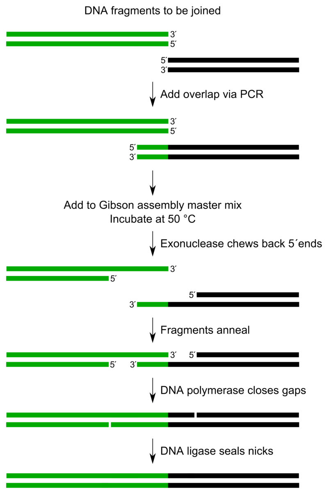
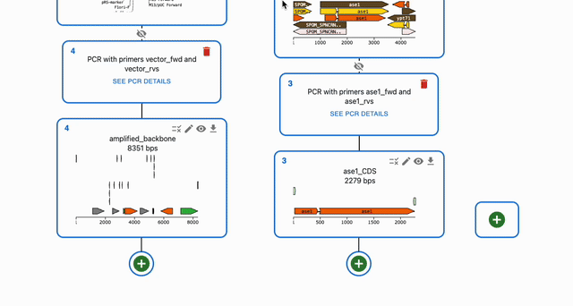

# Gibson Assembly

## What is Gibson Assembly?

* Gibson Assembly is a method to join DNA linear fragments that have shared sequences at their ends.
* It uses an exonuclease that chews back DNA from the 5' end of the fragments, creating sticky ends at both ends of fragments, so that they can be joined together.
* Finally, a DNA polymerase adds the complementary strand of gaps left by the exonuclease, and a ligase removes nicks.

Created by Tobias Vornholt [CC BY-SA 4.0](https://creativecommons.org/licenses/by-sa/4.0/)

## How to plan Gibson Assembly using OpenCloning

A Gibson assembly takes as input sequences that already have shared overlaps at their ends. If you need to design primers to add the Gibson shared overlaps via PCR, see [Primer design](../primer_design.md#primer-design-for-gibson-assembly).

To simulate Gibson Assembly, click on the plus icon below a sequence in the `Cloning` tab and select `Gibson Assembly`. Then, select the sequences that you want to combine in the `Assembly inputs` field.

### Circularizing a single fragment using Gibson Assembly

You can use Gibson Assembly to circularize a single fragment. To do so, don't select any other sequence in the `Assembly inputs` field. And click on `Submit`.

You can also [design primers for this](../primer_design.md#designing-primers-to-circularize-a-single-fragment-using-gibson-assembly).

