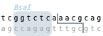
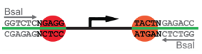
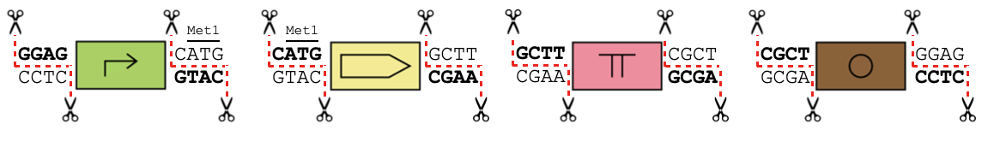
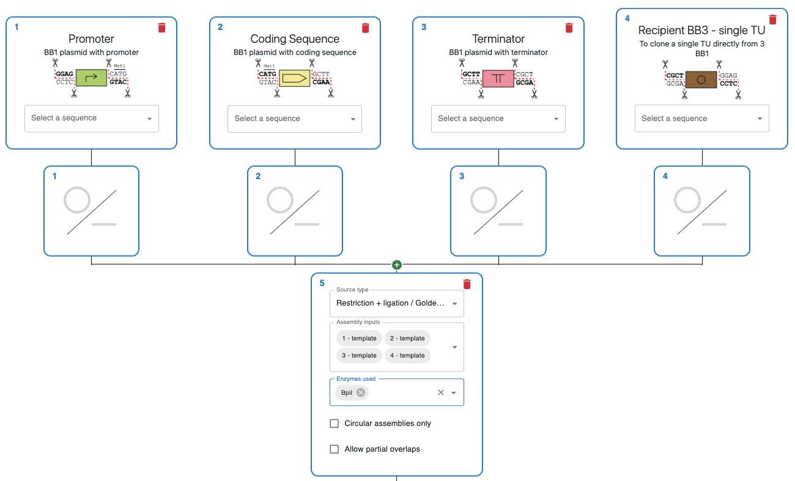

# Golden Gate Assembly

## What is Golden Gate Assembly?

A Golden Gate Assembly is just a restriction / ligation reaction that uses type II restriction enzymes, like BsaI. In these enzymes, the recognition site is different from the cut site, so you can generate any type of overhang for them. See the example below for BsaI, where the recognition site `GGTCTC` is different from the place they cut.

### MoClo / Modular cloning

MoClo kits contain plasmids that follow a convention or "syntax". Sets of plasmids within the kit contain the same type of "part". For instance: promoters, coding sequences, RBS, terminators, etc. Plasmids containing parts of the same type, when cut with a type II restriction enzyme, always generate the same overhangs.

For example, in the [CIDAR kit](https://doi.org/10.1021/acssynbio.5b00124), plasmids that contain promoters always produce a fragment containing the promoter flanked with `GGAG` and `ATGA` 5' overhangs when cut with BsaI.

From [doi:10.1021/acssynbio.5b00124](https://doi.org/10.1021/acssynbio.5b00124)

Parts of certain types are meant to be assembled together through Golden Gate. The simplest kit would involve the assembly of a promoter, coding sequence, terminator and backbone. Because the overhangs of each part of the assembly are always the same, you can make any combination of parts. In fact, you can create them in a single Golden Gate reaction in what's known as a "Combinatorial Assembly".

Below is the syntax for [GoldenPiCS](https://doi.org/10.1186/s12918-017-0492-3), a combinatorial assembly kit.

You can load a template to use this kit in OpenCloning [here](https://app.opencloning.org/?source=template&key=kits-gasser-goldenpics&template=assembly_template_001.json).

## How to plan Golden Gate Assembly using OpenCloning

Like any other cloning method, click on the plus icon below a sequence in the `Cloning` tab and select `Restriction + ligation / Golden Gate`. Then, select the input sequences in the `Assembly inputs` field, as well as the enzyme you want to use (you can use more than one). If you know that your desired product is a circular plasmid, tick `Circular Assemblies only` to exclude other possible linear assemblies from the results.

### Extra features

* If you are using a MoClo kit, you can speed up the process by using the existing templates or create your own (see [Templates](../templates.md)).
* If you want to design primers for the Golden Gate Assembly (see [Primer design](../primer_design.md#primer-design-for-golden-gate-assembly)).
* If you want to separate the restriction and ligation steps (see [Restriction / Ligation](../methods/restriction_ligation.md#separate-restriction-and-ligation)).