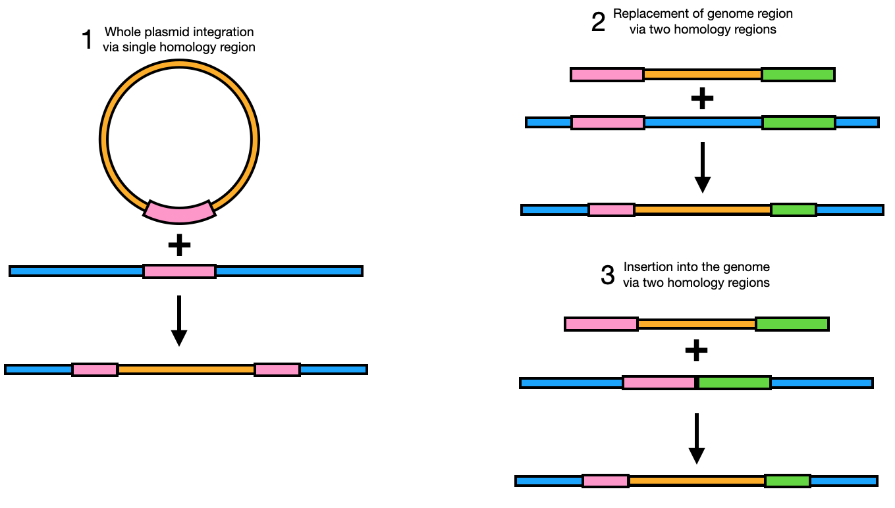

# Homologous Recombination

## What is homologous recombination?

Homologous recombination is a process of exchange of DNA fragments between two DNA molecules based on common subsequences, also referred to as "homologous" sequences. In OpenCloning, the homologous recombination method is specificallyfor genome integration. For In Vivo Assembly, which also relies on homologous recombination, see [In Vivo Assembly](../methods/in_vivo_assembly.md).

In the context of genome engineering, homologous recombination occurs when a donor DNA molecule (generally a plasmid or linear DNA transformed into a cell / organism) integrates into the genome based on shared subsequences between the donor sequence and the genome. Three typical examples are displayed below:

## How to plan homologous recombination / genome integration using OpenCloning

Like any other cloning method, click on the plus icon below a sequence in the `Cloning` tab and select `Homologous recombination`. You will be asked to select the `Template Sequence` (that should be the genome) and the `Insert Sequence` (that should be the donor sequence that you transformed, plasmid or linear DNA).

`Minimal homology length` is the minimum length of the shared subsequence between the donor and the genome that is required for the integration to occur.

!!! info "Getting too many results or no results in homologous recombination?"
    **Too many results**: Always try to use a value of `Minimal homology length` as high as possible, specially when there are mismatches between the donor sequence and the genome. This should not happen when you design or amplify the homology arms specifically for the target genome, but you may be using homologous arms from a pre-existing plasmid that does not exactly match your genome. In that case, OpenCloning finds several small homology regions separated by mismatches, rather than a single large homology region. That's why it shows you many results.

    **No results**: If you get no results, it may be that the mismatches don't make up for a single homology region of size `Minimal homology length`. Reduce the `Minimal homology length` and see if you get results.

If you want to design primers for the homologous recombination, see [Primer design](../primer_design.md#primer-design-for-homologous-recombination).