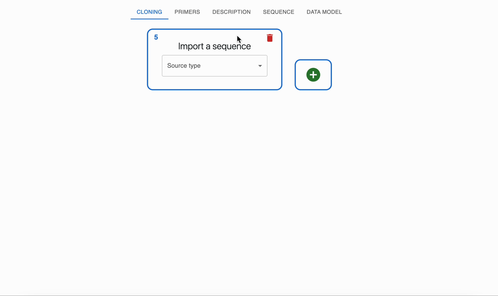

# Oligonucleotide hybridization

## What is oligonucleotide hybridization?

Two synthetic single‑stranded DNA oligonucleotides can be designed with complementary regions so that, when mixed and annealed, they form a double‑stranded DNA fragment. If each oligo has short 5' overhangs that are not complementary, the hybridized product will be a double‑stranded core with single‑stranded 5' overhangs at each end.

If a polymerase is added, it can fill in the 5' overhangs to create a fully double‑stranded product, this known as [Polymerase extension of overhangs](./polymerase_extension.md), and the combination of oligonucleotide hybridization and polymerase extension of overhangs is known as [Templateless PCR](./templateless_pcr.md).

## How to plan oligonucleotide hybridization using OpenCloning

Unlike other cloning methods, Oligonucleotide hybridization does not require any input sequence:

* From the root `Import a Sequence` form, select `Oligonucleotide hybridization`.
* Provide two oligos that are complementary on their 3' ends as inputs. To see how to add oligos to the session, see [creating primers](../primers.md#creating-primers).
* OpenCloning simulates annealing by aligning complementary regions and reports the resulting double‑stranded product, including any remaining single‑stranded overhangs if present.

