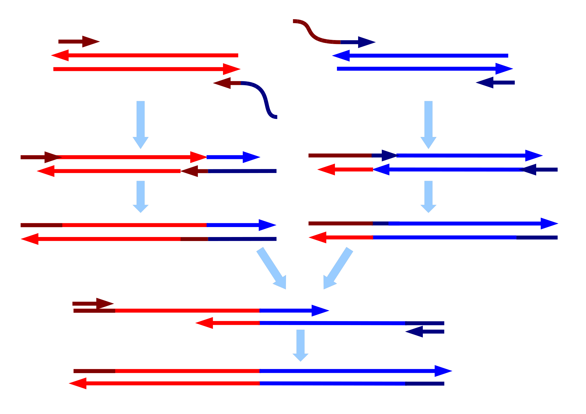

# Overlap Extension PCR

## What is Overlap Extension PCR?

Overlap Extension PCR fuses two or more DNA fragments that share short homologous overlaps at their ends:

* Internal primers carry 5' tails that encode the desired overlap, which can be a spacer like in the picture below, or simply match the sequences to be joined.
* After initial amplification, the overlapping fragments anneal and are extended to create the full-length product, which can then be amplified by outer primers.

Created by Staticd [CC BY-SA 3.0](https://creativecommons.org/licenses/by-sa/3.0/)

## How to plan Overlap Extension PCR using OpenCloning

Like any other cloning method, click on the plus icon below a sequence in the `Cloning` tab and select `Join Overlap Extension PCR fragments`. Then, select the sequences to combine in the `Assembly inputs` field. OpenCloning checks adjacent fragments for sufficient terminal homology and proposes valid fused products.

If you want to design primers for Overlap Extension PCR, see [Primer design](../primer_design.md#primer-design-for-overlap-extension-pcr).

