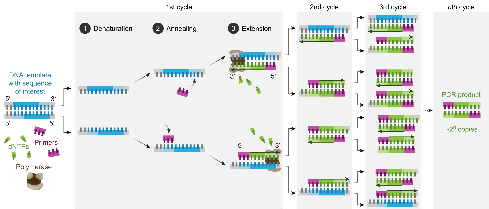
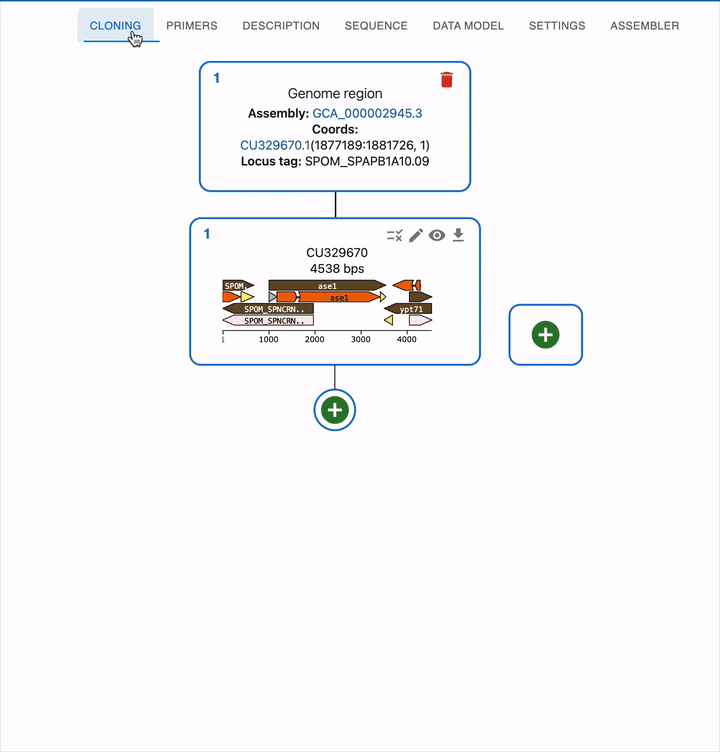
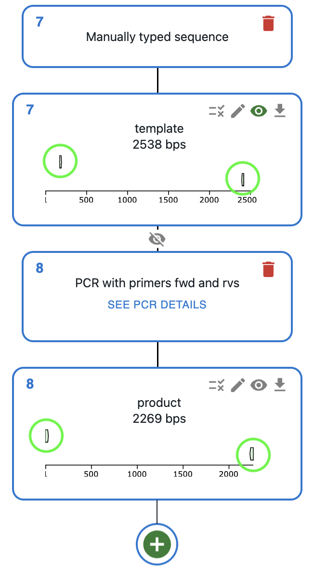
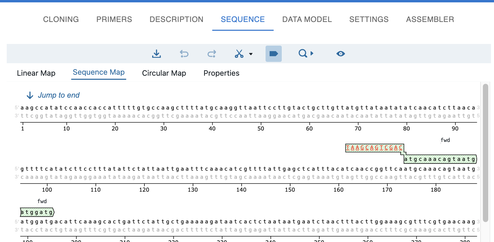

# PCR

## What is PCR?

PCR (Polymerase Chain Reaction) is a technique to amplify a DNA sequence. It requires a template sequence (what we want to amplify) and two primers. They are combined into a reaction mix containing a thermostable DNA polymerase and dNTPs. Then, the mix undergoes a series of temperature cycles that allow:

1. **Denaturation:** The mix is heated to break the hydrogen bonds between the double stranded DNA template, separated into two single stranded DNA molecules.
2. **Annealing:** The mix is cooled down, and the primers can bind to the ssSNA template.
3. **Extension:** The DNA polymerase adds nucleotides to the 3' end of the DNA molecule, and the DNA molecule is elongated.

The process is repeated for multiple cycles, and the result is a exponential amplification of the target sequence.

Created by [Enzoklop](https://en.wikipedia.org/wiki/Polymerase_chain_reaction#/media/File:Polymerase_chain_reaction-en.svg) [CC BY-SA 4.0](https://creativecommons.org/licenses/by-sa/4.0/)

### Adding primer tails and its application for cloning

You can also add extra bases to the 5' end of the primers to incorporate extra sequences to the ends of the amplified product. This can be useful for:

* Adding homology arms to the ends of the amplified product to join it to other fragments via [Gibson Assembly](./gibson.md) or [In Vivo Assembly](./in_vivo_assembly.md), or integrate it into the genome via [Homologous Recombination](./homologous_recombination.md) or [CRISPR-HDR](./crispr_hdr.md).
* Adding restriction sites to the ends of the amplified product to integrate it into a plasmid via [Restriction and Ligation](./restriction_ligation.md).

## How to plan PCR using OpenCloning?

Like any other cloning method, click on the plus icon below your template sequence in the `Cloning` tab and select `PCR`. You will be able to select the primers to use, or alternatively design them directly using the [Primer designer](../primer_design.md).

## Parameters used to calculate melting temperature and thermodynamic properties

* You can set the parameters used to calculate melting temperature and other thermodynamic properties in the [Settings tab](../settings.md).
* They are displayed in the [primer table](../primers.md#the-primer-table) and used for [primer design](../primer_design.md).
* Before a primer is used in a PCR, its melting temperature and GC content are calculated for the full primer.
* Once it is used in a PCR, its melting temperature and GC content for the binding part of the primer are displayed, as well as the heterodimer formation info.

## Display of bound primers

Once you do a PCR, you will see the primers in the sequence editor, both in the template and in the product.

  

  
  

  

  
  

