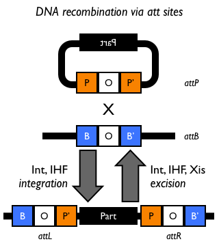
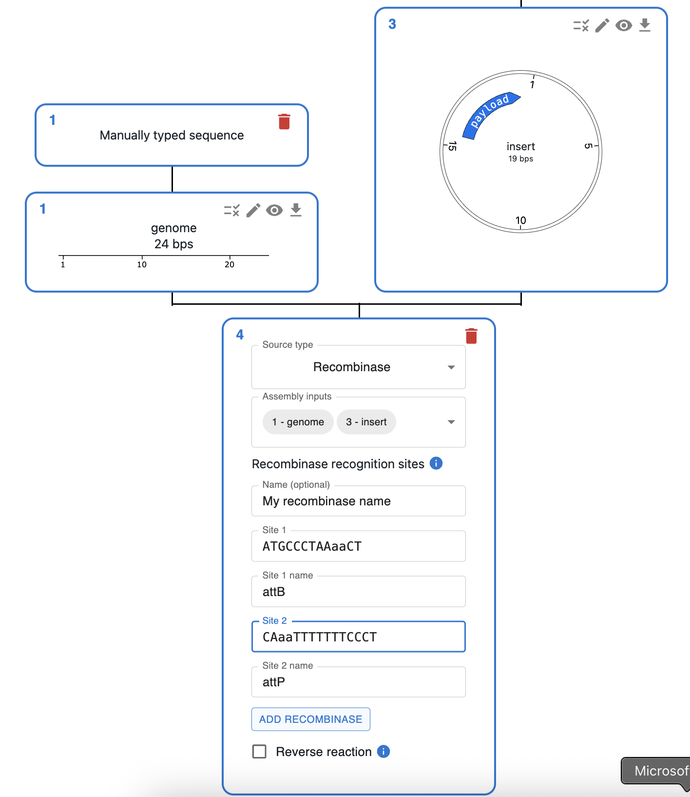

# Phage Recombinases

## What is Recombinase-Mediated Cloning?

### Biological context

Recombinase-mediated cloning relies on site-specific recombinases that recognise short DNA sequences and catalyse recombination between them. This is similar to [Gateway Cloning](./gateway.md) and [Cre/Lox recombination](./cre_lox.md), but OpenCloning’s `Recombinase` source lets you define *custom* recombinases and their recognition sites.

* Recombinases bind to pairs of recognition sites and catalyse recombination between them.
* Many systems use a longer site (*attP*) and a shorter site (*attB*), similar to phage integration.

Adapted from [iGEM wiki](https://parts.igem.org/Recombination/Bacteriophage_lambda-derived_att)

!!! info "Want to know more?"
    There is more detailed in the [Gateway Cloning](./gateway.md) page.

## How to do Phage Recombinase cloning in OpenCloning?

### Consensus recognition sites and formatting them

Before using your favourite recombinase, you will have to define two consensus recognition sites (equivalent to *attP*/*attB* or *attL*/*attR* in Gateway Cloning).

* In OpenCloning, they must follow the pattern **uppercase–lowercase–uppercase** (e.g. `AAaaTTCGGCA`, `ATGCCCTAAaaCT`).
* They can include [degenerate bases](https://www.bioinformatics.org/sms/iupac.html){:target="_blank" rel="noopener"} that represent several nucleotides (e.g. `N` for any nucleotide).
* The lowercase letters represent the homology region where sequences are joined, so they must match between the two sites of a pair.

When the two example sites (equivalent to `attR` and `attL`) are joined, they will recombine the fragments and generate new sites:

* `AAaaCT` (site1 > site2), like `attB`.
* `ATGCCCTAAaaTTCGGCA` (site2 > site1), like `attP`.

Some recombinases catalyse both the forward and reverse reactions (`attB + attP <--> attL + attR`). This is possible in OpenCloning by ticking the **Reverse reaction** option (see below).

### Planning the reaction

* Like other assembly methods, click the plus icon below a sequence in the `Cloning` tab and select `Recombinase`.
* Select the input sequences in the `Assembly inputs` field. Use one fragment for excision, or two or more for integration.
* Add one or more recombinases by specifying their recognition sites. Each recombinase needs:
    * **Site 1** and **Site 2**: sequences matching the uppercase–lowercase–uppercase pattern (e.g. `AAaaTTC`, `CCaaGC`).
    * **Site 1 name** and **Site 2 name** (optional): labels such as `attB` and `attP`, which default to `attB` and `attP`.
    * **Name** (optional): a short name for the recombinase.
    * Click on `Add recombinase` to create it. You can use more than one recombinase in the same reaction.
* Tick **Reverse reaction** if you want both forward and reverse recombination to be considered.
* Click **Submit** to compute the products.

Recombinase interface: add custom recombinases with recognition sites and optional reverse reaction.

