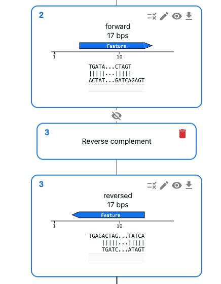

# Reverse Complement

## What does it mean to reverse complement a sequence?

It means inverting the order of the sequence, and complementing the bases (`A -> T`, `T -> A`, `C -> G`, `G -> C`).

When we think of double-stranded DNA, like plasmids and genome sequences, a sequence and its reverse complement are the same thing. However, it can be useful to reverse complement a sequence for cloning, for instance, to display a feature of interest in the forward orientation.

## How to reverse complement a sequence using OpenCloning?

You can reverse complement a sequence by clicking on the plus icon below a sequence in the `Cloning` tab and selecting `Reverse complement`.
