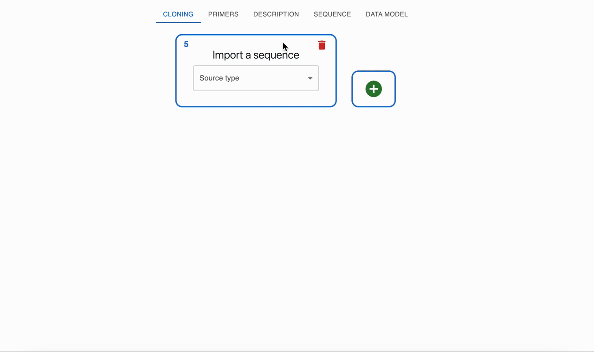

# Templateless PCR

## What is templateless PCR?

Templateless PCR generates double‑stranded DNA without an initial double-stranded DNA template by combining two designed oligonucleotides that hybridize to each on their 3' ends, leaving 5' overhangs that are then filled-in with a DNA polymerase. It is the combination of [Oligonucleotide hybridization](./oligonucleotide_hybridization.md) + [Polymerase extension of overhangs](./polymerase_extension.md).

## How to plan templateless PCR using OpenCloning

Do an [Oligonucleotide hybridization](./oligonucleotide_hybridization.md) and then a [Polymerase extension of overhangs](./polymerase_extension.md).

