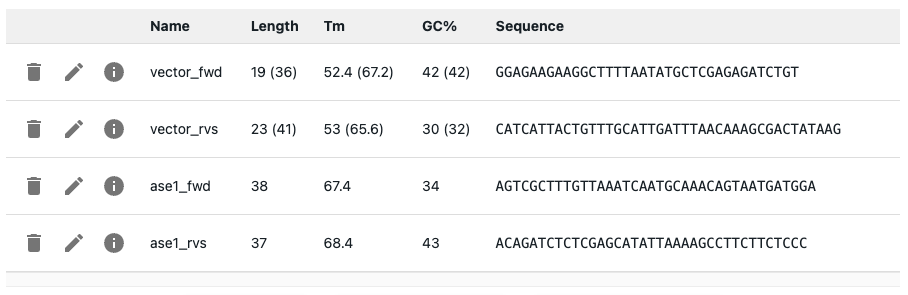
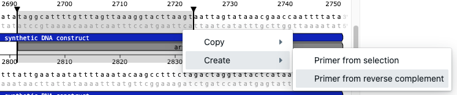

# Primers

## Creating primers

To create a primer, go to the `Primers` tab, and click on the `Add Primer` button. You will have to provide a name, and a sequence for it.

!!! warning "Primer constraints"

    * Names must be unique: You will not be able to create or import a primer with a name that already exists in the session.
    * Sequences can only contain valid DNA bases.

## Importing primers in bulk from a table

You can import primers from a tabular file by uploading a `.csv` or `.tsv` file. Go to the `Primers` tab, and click on the `Import from file` button.

> You can generate a csv file from Excel or Google Sheets by clicking on `File > Download as`.

The file must have the following columns (it can have others, but these must be present):

* `name`: the name of the primer.
* `sequence`: the sequence of the primer.

## Exporting primers

You can export primers to a `.csv` or `.tsv` file by clicking on the `Download primers` button.

## The primer table

!!! info "Parameters used to calculate melting temperature and other thermodynamic properties"
    You can set the parameters used to calculate and display melting temperature and other thermodynamic properties in the primer table and for [primer design](./primer_design.md) in the [Settings tab](./settings.md).

The primer table shows properties of the primers, and the icons on the left side of the table allow you to edit or delete the primer, and see extra info about it.

If the primers are used in a PCR or oligonucleotide hybridization, the information for the binding part is shown first, and the information for the full primer is shown in parenthesis. For example, below the primer `vector_forward` has a total length of 36bps, but only 19 bind to its template in the PCR, so the table shows `19 (36)` in the `Length` column.

You can get extra info by clicking on the info icon on the left side of the table.

* Whether primer forms homodimer or hairpins
* Whether the primer forms heterodimers (if it is used in a PCR)

The info icon will turn into a warning icon if the primer has values that fall outside the expected range.

## Editing primers

To edit a primer, click on the pencil icon on the left side of the table. That will open a form where you can edit the primer's name and sequence.

If it is used in a PCR or oligonucleotide hybridization, you will only be able to edit its name. If you want to edit the sequence, you will have to delete the PCR or hybridization where it is used, and then edit the primer.

## Deleting primers

To delete a primer, click on the trash icon on the left side of the table. You will not be able to delete it if it is used in a PCR or oligonucleotide hybridization.

## Designing primers

See the separate [primer design](./primer_design.md) page.

## Creating a primer from the sequence editor

You can create a primer from the sequence editor. Select a region of the sequence, right-click and select `Create`.

