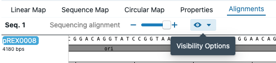

# Sequencing data

To verify that the sequences you designed match what you created in the lab, you can align sequencing data against the sequences you designed. To do that, click on the top-right icon of a sequence in the `Cloning` tab.

You will be able to select a sequencing file from your computer. It accepts fasta, genbank, ab1 and fastq files.

### Displaying alignments of sequencing data

To see the alignments, either click on the `See Alignments` button in that window, or just click on the top-right eye icon of the sequence in the `Cloning` tab. Either option will take you to the `Sequence` tab, and now the editor will have an extra tab: `Alignments`. Below is a full example:

### Displaying chromatograms or histograms in sequencing data (ab1 or fastq files)

Once you have loaded sequencing data, and aligned it to a sequence. Go to the sequence editor, and click on the eye icon of the `Alignments` tab that says `Visibility Options`.

Then, select `Chromatogram`. That will display a chromatogram and histogram of the sequencing data.

